# Laravel REST API — Setup Guide

Setting up the Laravel-based REST API from scratch. The API exposes a `users` resource and uses Laravel Sanctum for token-based authentication. Stack: **Laravel 11**, **Sanctum**, **MySQL 8**.

---

## Prerequisites

Before starting, ensure the following are installed on your machine:

- PHP >= 8.2
- Composer >= 2.x
- MySQL >= 8.0
- A database client (TablePlus, DBeaver, or MySQL Workbench)
- (Optional) Postman or Insomnia for testing endpoints

---

## 1. Project Setup

Create the Laravel project and open it in your editor:

```bash
composer create-project laravel/laravel api
cd api
code .
```

Install the API scaffold. This publishes the Sanctum configuration and adds the `routes/api.php` file:

```bash
php artisan install:api
```

After running this command, Laravel registers the `sanctum` middleware and creates `routes/api.php`.


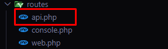

---

## 2. Database Connection

Open `.env` at the root of the project. Locate the `DB_*` block (lines 24–28) and fill in your local database credentials:

```env
DB_CONNECTION=mysql
DB_HOST=127.0.0.1
DB_PORT=3306
DB_DATABASE=your_database_name
DB_USERNAME=your_username
DB_PASSWORD=your_password
```

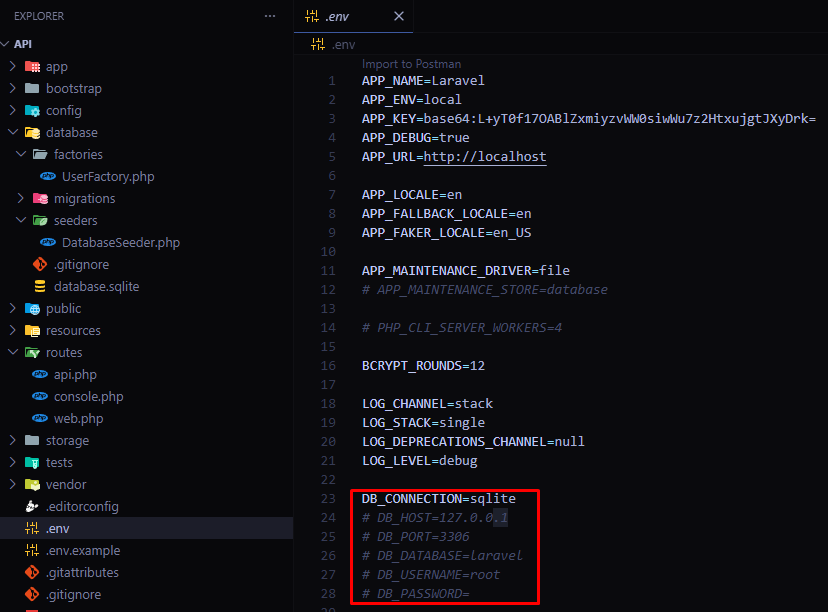

### Create the database

Before running migrations, create an empty database in MySQL matching the name you set in `DB_DATABASE`. Use your database client or run:

```sql
CREATE DATABASE your_database_name;
```

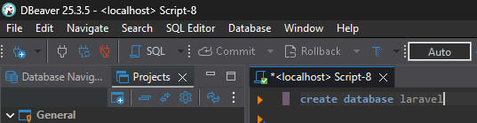
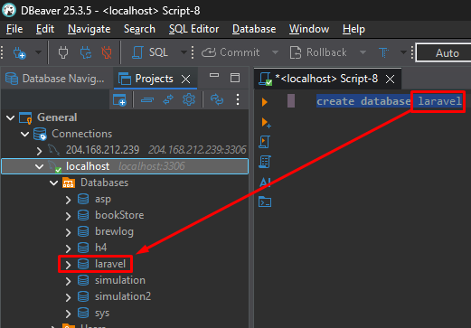
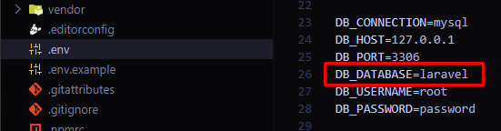

---

## 3. Migrations

Laravel ships with default migrations for `users`, `password_reset_tokens`, `sessions`, and `cache`. Run them to create the schema:

```bash
# State before migration — no tables exist yet
```

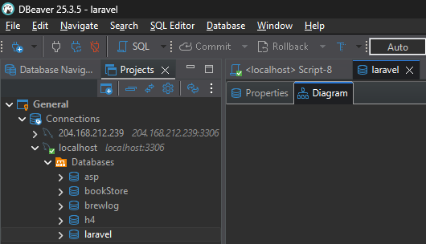

```bash
php artisan migrate
```

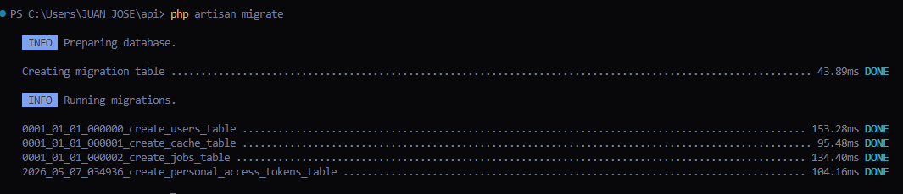
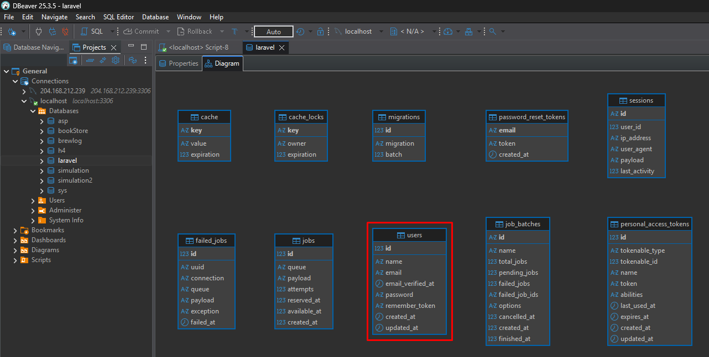

---

## 4. Seeders — Populate the Users Table

The `DatabaseSeeder` uses a factory to generate fake users. Open `database/seeders/DatabaseSeeder.php` and make the following changes:

1. Remove the example code block (highlighted in the screenshot below).
2. Uncomment the `User::factory()` call and set the number of records to generate.

```php
// Example: generate 10 fake users
User::factory(10)->create();
```

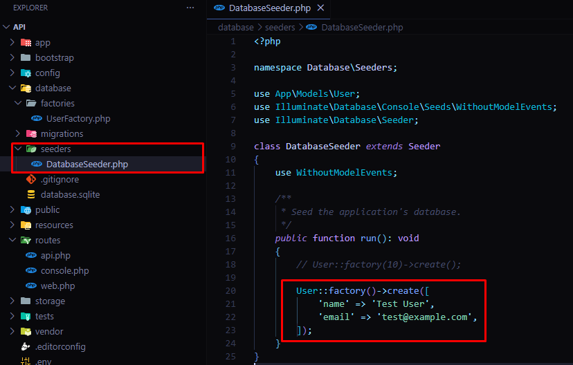
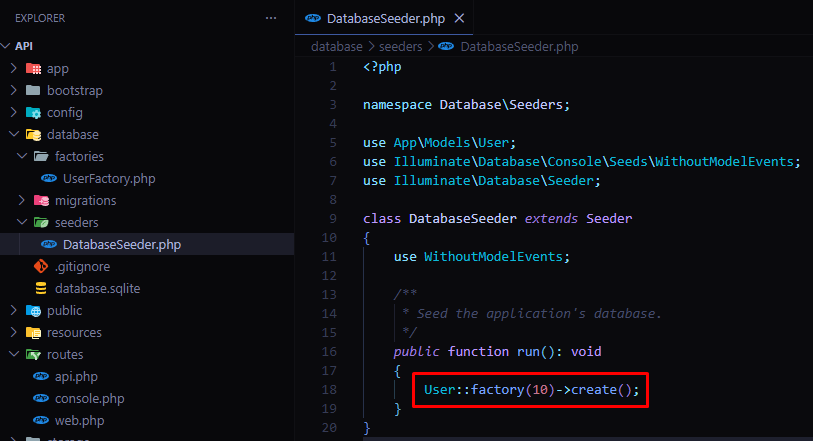

Run the seeder:

```bash
# Users table before seeding — empty
```

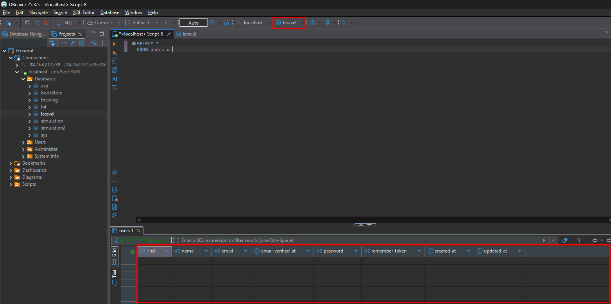

```bash
php artisan db:seed
```

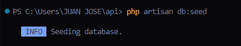
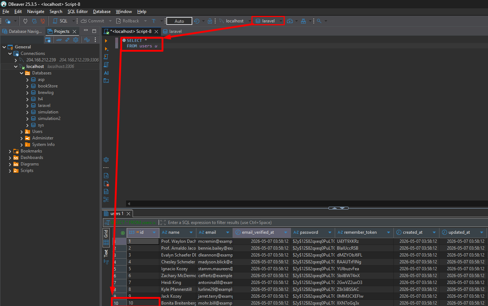

---

## 5. Resource Controller

Generate a resource controller for the `User` model. The `-r` flag scaffolds all seven RESTful methods (`index`, `show`, `store`, `update`, `destroy`, etc.):

```bash
php artisan make:controller Api/UserController -r
```

Open `app/Http/Controllers/Api/UserController.php` and inject the `User` model via route-model binding in `show`, `update`, and `destroy`.

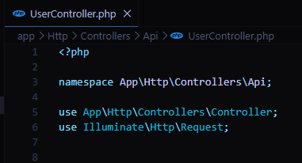
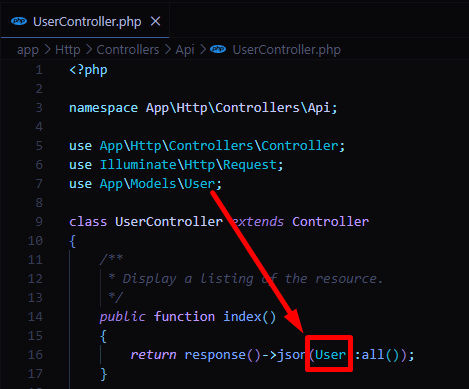

---

## 6. API Routes

Open `routes/api.php`. By default it only contains the Sanctum token route. Register the users resource:

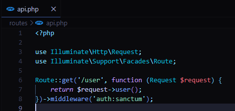

Add the following import and route registration:

```php
use App\Http\Controllers\Api\UserController;

Route::apiResource('users', UserController::class);
```

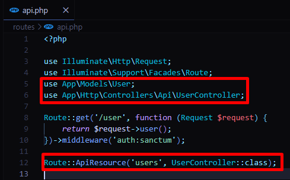

Each controller method maps to a standard HTTP endpoint. Below are the implementations:

**index** — returns a paginated list of users

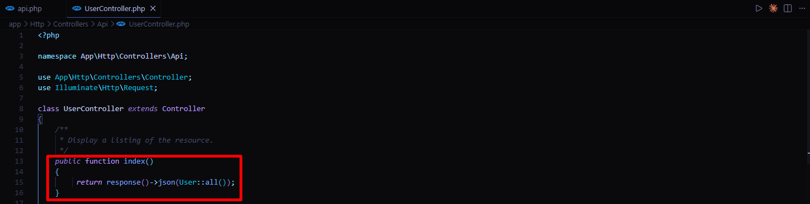

**store** — creates a new user

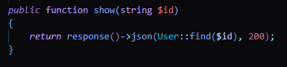

**show** — returns a single user by ID

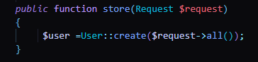

**update** — updates an existing user

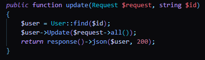

**destroy** — deletes a user

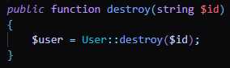

---

## 7. Start the Development Server

```bash
php artisan serve
```

The API is now available at `http://127.0.0.1:8000`.

---

## 8. Verify Routes and Endpoints

Confirm all routes are registered correctly:

```bash
php artisan route:list
```

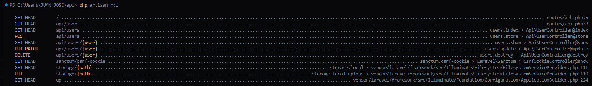

Test the `index` endpoint with curl:

```bash
curl http://127.0.0.1:8000/api/users
```

You should receive a JSON array of the seeded users. You can also import the base URL into Postman or Insomnia and test each endpoint (`GET`, `POST`, `PUT`, `DELETE`) against `/api/users`.
